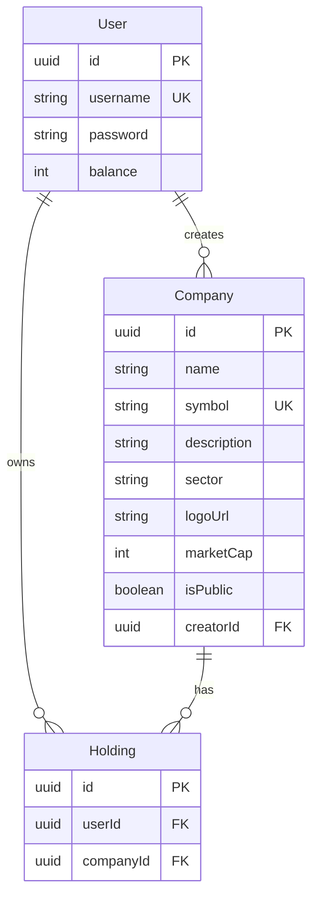

# DDCapital

Backend MVP para la T1 2026-2 en TypeScript, Express, Sequelize y PostgreSQL. DDCapital es un juego de inversion simple donde usuarios compran empresas completas.

## Concepto

Cada usuario entra con un budget inicial de `10000`. Puede crear empresas publicas o privadas, publicar empresas privadas, comprar empresas publicas, vender empresas de su portfolio y donar dinero a empresas publicas. Cada empresa tiene un `marketCap` entre `1000` y `5000`; donar incrementa ese `marketCap`.

Cada 1 hora el backend reinicia el estado jugable: elimina holdings, vuelve los balances a `10000` y resembrar el mercado base con nuevos valores. Las cuentas de usuario no se borran.

## Experiencia Esperada En Frontend

- Login/autoregistro y persistencia del token JWT.
- Vista de mercado con busqueda, filtros, paginacion y detalle de empresa.
- Creacion de empresas publicas o privadas.
- Publicacion de empresas privadas propias.
- Compra y venta de empresas publicas.
- Donaciones a empresas publicas para aumentar su `marketCap`.
- Portfolio con balance, empresas compradas, valor de cartera y patrimonio total.
- Rankings de usuarios por patrimonio y empresas por `marketCap`.
- Manejo visual de errores: saldo insuficiente, empresa no comprada, token invalido, datos invalidos y rate limit.

## Reglas Del Juego

- El login tambien registra usuarios nuevos si el `username` no existe.
- Los usuarios nuevos parten con `10000` de balance inicial.
- Las empresas creadas por usuarios pueden nacer publicas o privadas.
- Las empresas privadas propias se pueden publicar despues.
- Comprar una empresa descuenta su `marketCap` del balance y la agrega al portfolio.
- Vender una empresa la elimina del portfolio y devuelve su `marketCap` al balance.
- Donar descuenta saldo del usuario y suma ese monto al `marketCap` de la empresa.
- El mercado base se carga desde una lista de empresas del S&P 500 con valores de juego aleatorios.

## Modelo De Datos



Detalle de relaciones: `docs/erd.md`.

## Docs

- Flujo API/frontend: `docs/api-flow.md`
- ERD base de datos: `docs/erd.md`
- Deploy Render: `docs/deploy-render.md`
- Performance local: `docs/performance.md`
- Auditoria final: `docs/auditoria-final.md`
- Roadmap: `docs/roadmap/`

## Instalacion

```bash
npm install
cp .env.example .env
```

Configura PostgreSQL en `.env`. Puedes usar `DATABASE_URL` o las variables `DB_*`.

Variables principales:

- `DATABASE_URL` o `DB_HOST`, `DB_PORT`, `DB_NAME`, `DB_USER`, `DB_PASSWORD`, `DB_SSL`
- `JWT_SECRET`
- `JWT_EXPIRES_IN`
- `BACKEND_URL`
- `PORT`
- `NODE_ENV`
- `RATE_LIMIT_WINDOW_MS`, `RATE_LIMIT_MAX`, `RATE_LIMIT_TOKEN_MAX`, `RATE_LIMIT_DISABLED`

## Scripts

```bash
npm run dev
npm run build
npm run check
npm run check:api
npm run check:rate-limit
npm run perf
npm run start
npm run check:rankings
```

## API

Servidor local: `http://localhost:3000/api`

Swagger: `http://localhost:3000/api-docs`

Endpoints principales:

- `POST /api/login`
- `GET /api/me`
- `PATCH /api/me`
- `DELETE /api/me`
- `GET /api/companies`
- `GET /api/companies/:id`
- `POST /api/companies`
- `PATCH /api/companies/:id`
- `DELETE /api/companies/:id`
- `POST /api/companies/:id/publish`
- `POST /api/companies/:id/buy`
- `POST /api/companies/:id/sell`
- `POST /api/companies/:id/donate`
- `GET /api/portfolio`
- `GET /api/rankings/users`
- `GET /api/rankings/companies`

Detalle de requests/responses: `docs/api-flow.md`.
