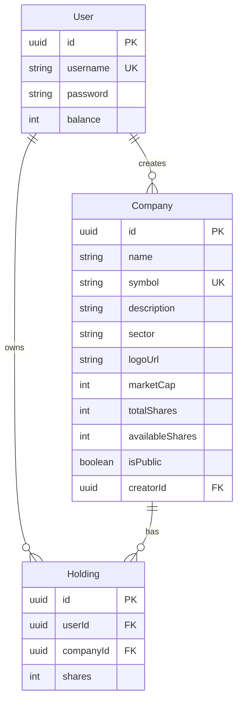

# T1 Back 2026-2

Backend MVP en TypeScript, Express, Sequelize y PostgreSQL para una aplicacion de mercado financiero ficticio.

## Concepto

La tarea propone construir un frontend para un juego de inversion simple: cada usuario entra con un saldo inicial, puede crear empresas privadas, publicarlas en el mercado y operar acciones de empresas publicas. La API modela el backend de ese mercado: usuarios, empresas, holdings, compras, ventas, donaciones, portfolio y rankings.

La tematica busca que el frontend no sea solo un CRUD. El flujo esperado es una experiencia tipo dashboard/marketplace donde el usuario puede revisar el mercado, filtrar empresas, ver precios, crear su propia empresa, abrir acciones al publico, invertir en otras empresas y revisar como cambia su patrimonio.

## Experiencia Esperada En Frontend

Un cliente deberia permitir:

- Login/autoregistro y persistencia del token JWT.
- Vista de mercado con busqueda, filtros, paginacion y detalle de empresa.
- Creacion de una empresa privada usando saldo del usuario.
- Publicacion de una empresa propia, definiendo cuantas acciones quedan disponibles.
- Compra y venta de acciones de empresas publicas.
- Donaciones a empresas publicas para aumentar su `marketCap`.
- Vista de portfolio con saldo, holdings, valor de cartera y patrimonio total.
- Rankings de usuarios por patrimonio y empresas por valor de mercado.
- Manejo visual de errores como saldo insuficiente, acciones insuficientes, token invalido, datos invalidos y rate limit.

## Reglas Del Juego

- El login tambien registra usuarios nuevos si el `username` no existe.
- Los usuarios nuevos parten con `100000` de balance inicial.
- Las empresas creadas por usuarios nacen privadas.
- Para operar una empresa en el mercado, su creador debe publicarla.
- El precio por accion se calcula como `Math.floor(marketCap / totalShares)`.
- Comprar acciones descuenta saldo y crea o actualiza un holding.
- Vender acciones devuelve saldo y reduce el holding.
- Donar aumenta el `marketCap` de la empresa y reduce el saldo del usuario.
- El seed carga empresas iniciales del S&P 500 como mercado base.

## Modelo De Datos



Detalle de relaciones: `docs/erd.md`.

## Docs

- Flujo API/frontend: `docs/api-flow.md`
- ERD base de datos: `docs/erd.md`
- Deploy Render: `docs/deploy-render.md`
- Performance local: `docs/performance.md`
- Auditoria final: `docs/auditoria-final.md`
- Roadmap: `docs/roadmap/`

## Instalacion

```bash
npm install
cp .env.example .env
```

Configura PostgreSQL en `.env`. Puedes usar `DATABASE_URL` o las variables `DB_*`.

Variables principales:

- `DATABASE_URL` o `DB_HOST`, `DB_PORT`, `DB_NAME`, `DB_USER`, `DB_PASSWORD`, `DB_SSL`
- `JWT_SECRET`
- `JWT_EXPIRES_IN`
- `BACKEND_URL`
- `PORT`
- `NODE_ENV`
- `RATE_LIMIT_WINDOW_MS`, `RATE_LIMIT_MAX`, `RATE_LIMIT_TOKEN_MAX`, `RATE_LIMIT_DISABLED`

## Scripts

```bash
npm run dev
npm run build
npm run check
npm run check:api
npm run check:rate-limit
npm run perf
npm run start
npm run check:rankings
```

## Validacion y produccion

```bash
npm run check
npm run build
npm run start
```

En Render puedes usar el Blueprint `render.yaml`. Detalle: `docs/deploy-render.md`.

## Performance local

Con la API corriendo:

```bash
npm run perf
LOAD_PATH='/companies?limit=20' LOAD_REQUESTS=300 LOAD_CONCURRENCY=30 npm run perf
```

Si quieres medir throughput sin rate limit, levanta el server con `RATE_LIMIT_DISABLED=true`.

## Flujo MVP

1. `POST /api/login`
2. `GET /api/companies`
3. `POST /api/companies`
4. `POST /api/companies/:id/publish`
5. `POST /api/companies/:id/buy`
6. `POST /api/companies/:id/donate`
7. `POST /api/companies/:id/sell`
8. `GET /api/portfolio`
9. `GET /api/rankings/users`
10. `GET /api/rankings/companies`

## API

Servidor local: `http://localhost:3000/api`

Swagger: `http://localhost:3000/api-docs`

Endpoints principales:

- `POST /api/login`
- `GET /api/me`
- `GET /api/companies`
- `POST /api/companies`
- `POST /api/companies/:id/publish`
- `POST /api/companies/:id/buy`
- `POST /api/companies/:id/sell`
- `POST /api/companies/:id/donate`
- `GET /api/portfolio`
- `GET /api/rankings/users`
- `GET /api/rankings/companies`

Detalle de requests/responses: `docs/api-flow.md`.
