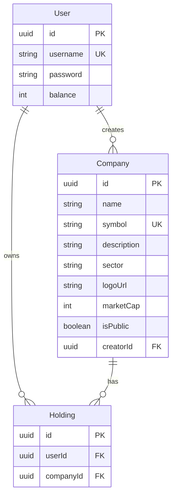

# ERD

## Relaciones

- `User` crea cero o muchas `Company` mediante `Company.creatorId`.
- `User` posee cero o muchos `Holding`.
- `Company` tiene cero o muchos `Holding`.
- `Holding` representa que un usuario tiene una empresa en su portfolio.
- `Holding` tiene indice unico compuesto en `userId` + `companyId`.
